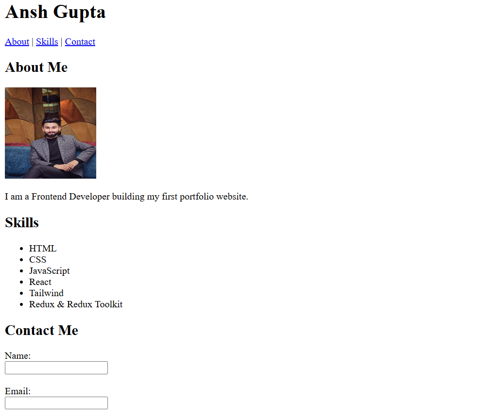

# Personal Portfolio - Ansh Gupta

This is a professional personal portfolio website designed to showcase my frontend development skills, technical stack, and projects.

## 🚀 Project Overview
The primary goal of this project is to create a clean, responsive, and semantic digital presence. It acts as a professional summary for recruiters, highlighting my expertise in React, Tailwind CSS, and Redux, while providing an easy way for potential collaborators to reach out via a contact form.



## 🛠️ Technical Details & HTML Concepts
I have implemented several core HTML5 concepts to ensure high quality and accessibility:
* **Semantic HTML:** Used tags like `<header>`, `<nav>`, `<main>`, and `<section>` for better SEO and screen-reader support.
* **Form Validation:** Integrated a contact form with `required` attributes for client-side validation.
* **Navigation:** Used anchor tags for smooth internal page navigation.
* **Media Optimization:** Included profile imagery with descriptive `alt` tags for better accessibility.

## 📂 Code Structure
The repository is organized with a clear file hierarchy for easy maintenance:
```text
portfolio/
├── index.html          # Core structure and content
├── images/             # Directory for all visual assets
│   └── portfoliophoto.jpeg
└── README.md           # Project documentation and guide

